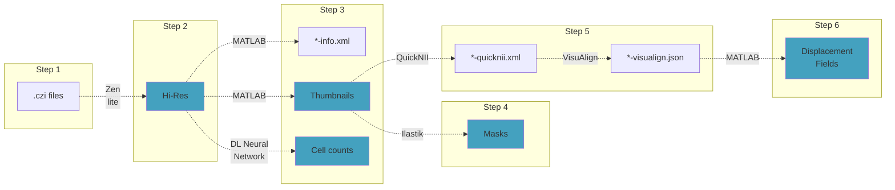

# How to get all the files you need

[⬅ previous](02_filesPreparation.md)

## Main workflow

The following flowchart represent the main workflow from raw files straight out of the acquisition microscope (`.czi` zeiss files) to the necessary files described in [Files Preparation](02_filesPreparation.md).

- Output **files** that you will need for the final analysis are marked in blue.
- The **software** that you can use to go from one file to the next is shown in the arrow

## Index

1. [Step 1 - raw files](#step-1---raw-files)
2. [Step 2 - hi-res images](#step-2---hi-res-images)
3. [Step 3 - thumbnails](#step-3---thumbnails)
4. [Step 4 - masks](#step-4---masks)
5. [Step 5 - alignment](#step-5---alignment)
6. [Step 6 - displacement fields](#step-6---displacement-fields)

## Sources for external software

Download and install the required external software from these sources:

- [Zen lite](https://www.zeiss.com/microscopy/int/products/microscope-software/zen-lite.html)
- [MATLAB](https://it.mathworks.com/products/matlab.html)
- [Cell-counting neural network](https://github.com/ciampluca/counting_perineuronal_nets)
- [Ilastik](https://www.ilastik.org/)
- [QuickNII](https://www.nitrc.org/projects/quicknii)
- [Visualign](https://www.nitrc.org/projects/visualign/)

## Step 1 - raw files

## Step 2 - hi-res images

### Export images from .czi files

## Step 3 - thumbnails

### Generate an Info XML file

### Generate thumbnails

### Generate Cell Counts

## Step 4 - masks

### Create masks

### Refine masks

## Step 5 - alignment

### Global alignment with quickNII

### Non-rigid alignment with VisuAlign

## Step 6 - displacement fields

### Create displacement fields

---

*Leonardo Lupori* - 2022
