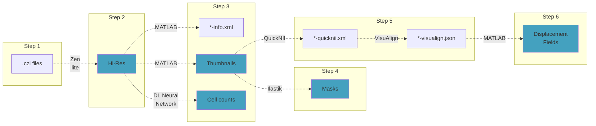

# How to get all the files you need

[⬅ previous](02_filesPreparation.md)

## Main workflow

The following flowchart represent the main workflow from raw files straight out of the acquisition microscope (`.czi` zeiss files) to the necessary files described in [Files Preparation](02_filesPreparation.md).

- Output **files** that you will need for the final analysis are marked in blue.
- The **software** that you can use to go from one file to the next is shown in the arrow

## Index

1. [Step 1 - raw files](#step-1---raw-files)
2. [Step 2 - hi-res images](#step-2---hi-res-images)
3. [Step 3 - thumbnails](#step-3---thumbnails)
4. [Step 4 - masks](#step-4---masks)
5. [Step 5 - alignment](#step-5---alignment)
6. [Step 6 - displacement fields](#step-6---displacement-fields)

## Sources for external software

Download and install the required external software from these sources:

- [Zen lite](https://www.zeiss.com/microscopy/en/products/software/zeiss-zen.html)
- [MATLAB](https://it.mathworks.com/products/matlab.html)
- [Cell-counting neural network](https://github.com/ciampluca/counting_perineuronal_nets)
- [Ilastik](https://www.ilastik.org/)
- [QuickNII](https://www.nitrc.org/projects/quicknii)
- [Visualign](https://www.nitrc.org/projects/visualign/)

## Step 1 - Raw files

The build-up of the mouse folder begins with RGB `.tif` images, in which each imaging channel is stored separately (the pipeline can support up to 3 channels).

Acquisition of microscopy images with most commercially available microscopes typically produces raw files in a proprietary format—for instance, ZEISS microscopes typically produce `.czi` files, while Leica microscopes produce `.lif` files. These files need to be exported to RGB `.tif` format for the later stages of the pipeline.

[!NOTE]
This pipeline was originally designed for a workflow starting from `.czi` files. For this type of files we found that exporting the data as RGB images is the most convenient strategy. Other microscopes and software might allow to directly export imaging channels as separate grayscale images (see [Step 2 - hi-res images](#step-2---hi-res-images)). While limited code changes could allow to use these type of images as starting point, such changes have not yet being implemented at the time of writing.

This can be done in different ways depending on the original extension of the raw files. Here are a few possibilities.

### Export images from `.czi` Files

`.czi` files can be exported using the [Zen Software](https://www.zeiss.com/microscopy/en/products/software/zeiss-zen.html). A free version of the software can be installed on your machine for basic image processing, including image export. The full version that controls the ZEISS microscope and is typically purchased with it can also be used for image export.

To export images in Zen:
- Go to the `Processing` tab and select the `Image Export` method.
- Select the TIF extension and the LZW compression.

[!IMPORTANT] If your acquisition is not in 8-bit, remember to apply the same display settings to all the files of your experiment. If you have more than one channel, apply consistent channel colors (pure red, green, and blue) across all the files. When exporting images from the file, this will allow to produce separate grayscale image for each channel.

### Export images from `.lif` Files

`.lif` files can be exported using the [LAS X Office](https://www.leica-microsystems.com/products/microscope-software/) software. Similar to Zen, a free version is available at the time of writing for basic visualization and image export.

To export images with LAS X:
- Open your project.
- Select the regions containing the slices.
- Right-click and select **Image Export**.

Since LAS X typically exports grayscale single-channel images, a further step may be needed to reconstruct an RGB `.tif` file.

### Export images through ImageJ

Both `.lif` and `.czi` files can be exported to `.tif` using the ImageJ plugin `Bio-Formats`, which is included in the Fiji distribution.  
This is a convenient option if you do not want to install dedicated microscope software on your machine.  
A further step may be needed to reconstruct an RGB `.tif` file from the separated grayscale channels.

## Step 2 - hi-res images

## Step 3 - thumbnails

### Generate an Info XML file

### Generate thumbnails

### Generate Cell Counts

## Step 4 - masks

### Create masks

### Refine masks

## Step 5 - alignment

### Global alignment with quickNII

### Non-rigid alignment with VisuAlign

## Step 6 - displacement fields

### Create displacement fields

---

*Leonardo Lupori and Valentino Totaro*
